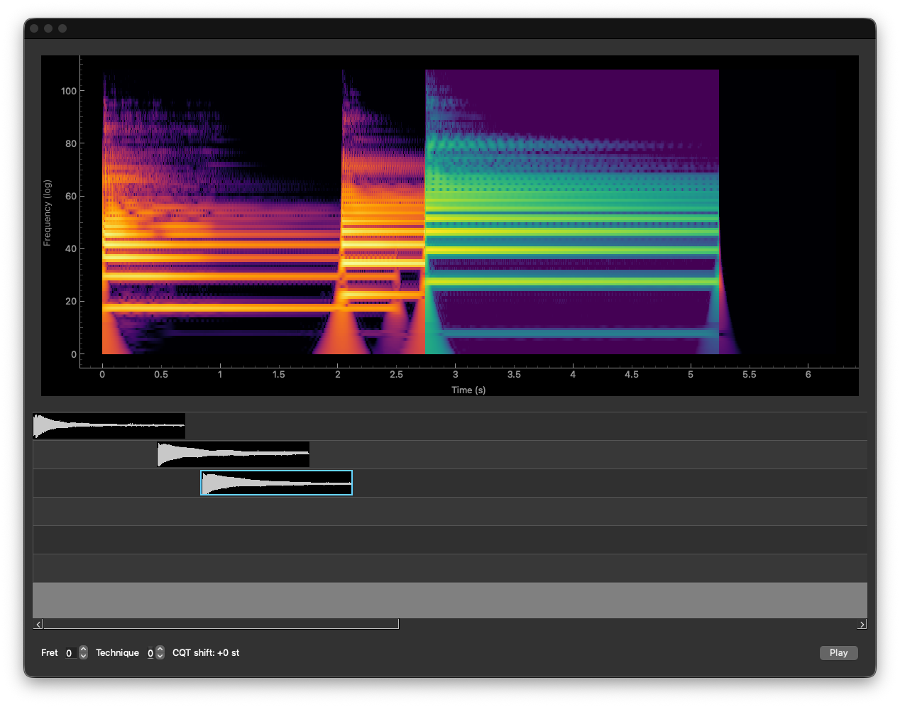

# frt

`frt` is a Python project for machine learning experiments in guitar fret transcription. It includes tools for generating synthetic labeled guitar audio, extracting audio features, training a PyTorch transcription model, and decoding model outputs back into note events.

The project also includes a small PyQt6 desktop app for inspecting samples, timelines, waveforms, and spectrograms while developing the dataset and model pipeline.

## Features

- Synthetic guitar-note dataset generation
- Onset-and-frames style transcription model in PyTorch
- Audio feature extraction and label encoding utilities
- Timeline rendering and sample-library tools
- PyQt6 UI for visual inspection and playback

## Setup

This project uses `uv` and requires Python 3.13 or newer.

```bash
uv sync
```

## Usage

Generate a dataset:

```bash
uv run frt-generate-dataset --help
```

Train the transcriber:

```bash
uv run frt-train-transcriber --help
```

Launch the desktop app:

```bash
uv run frt
```

## Tests

```bash
uv run python -m unittest discover
```
